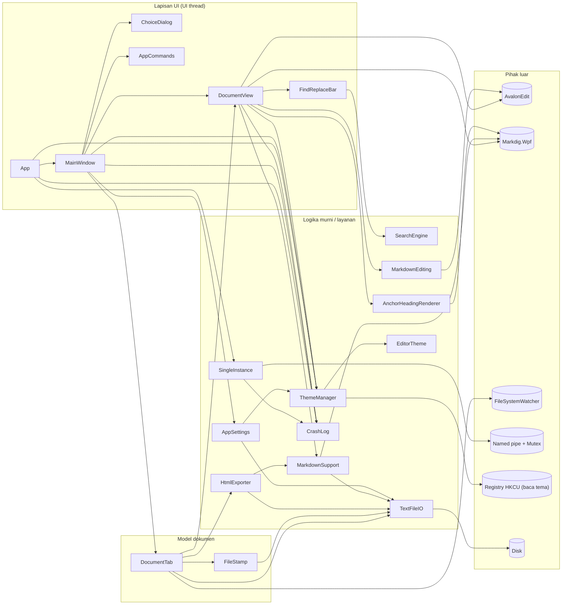
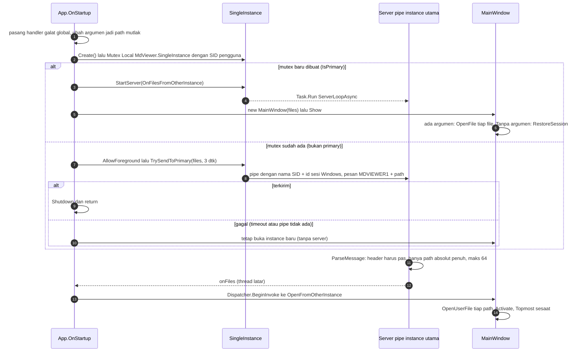
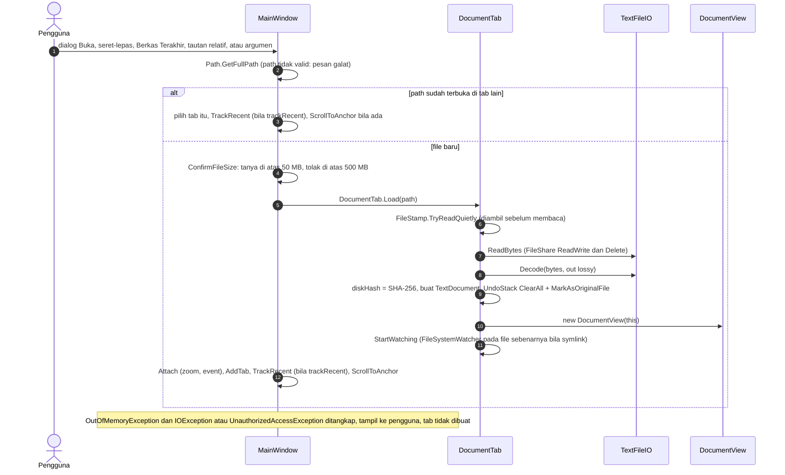
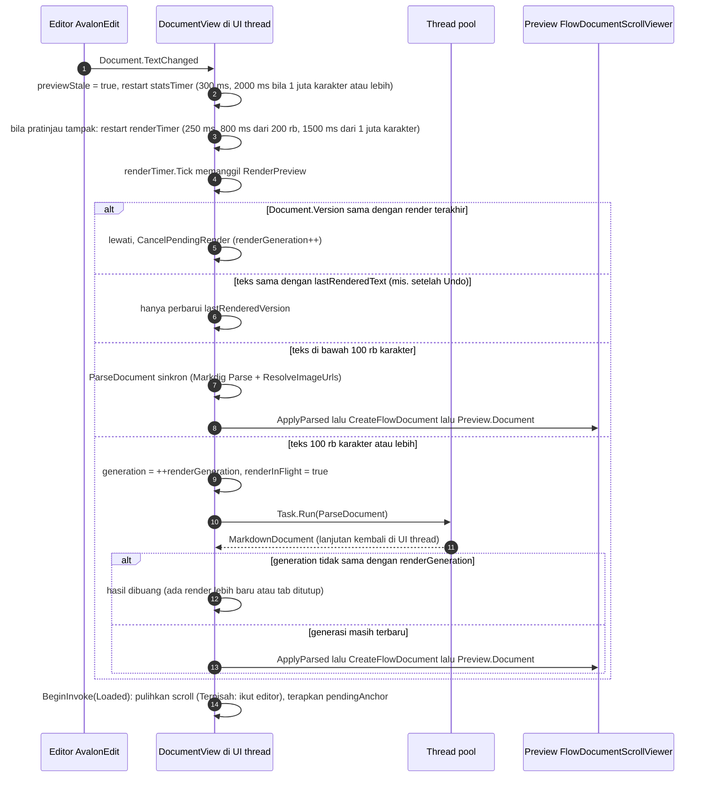
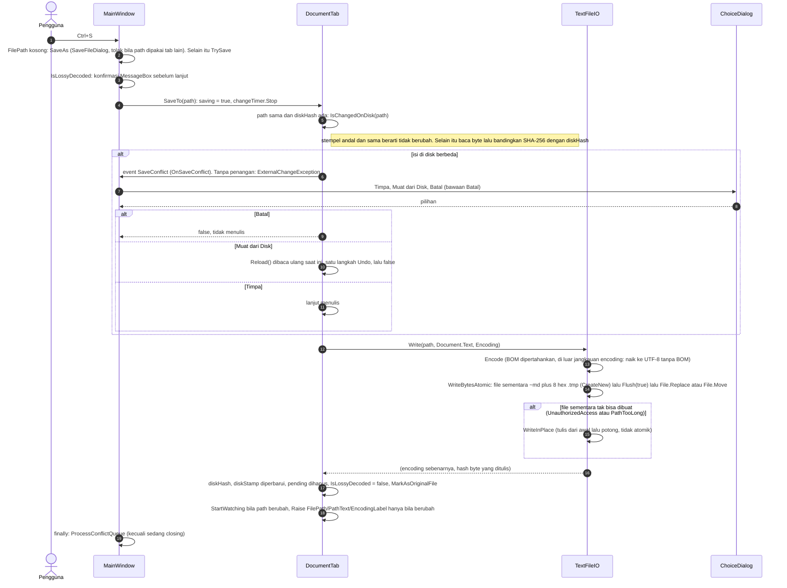
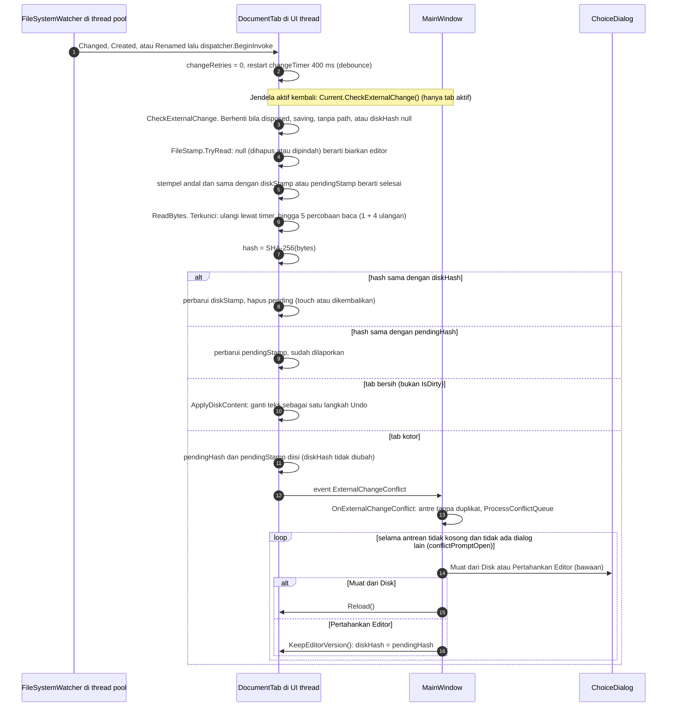
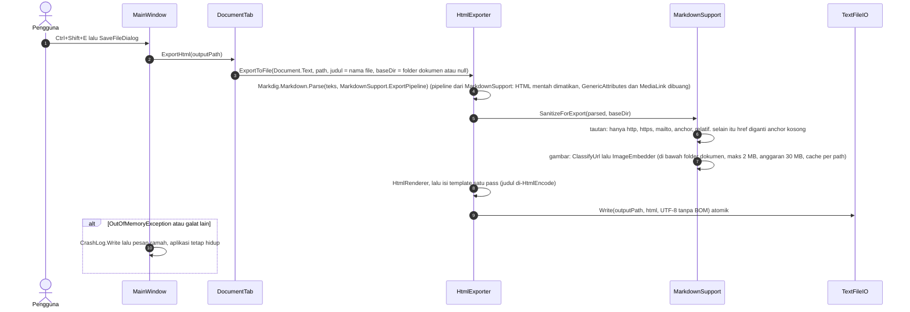
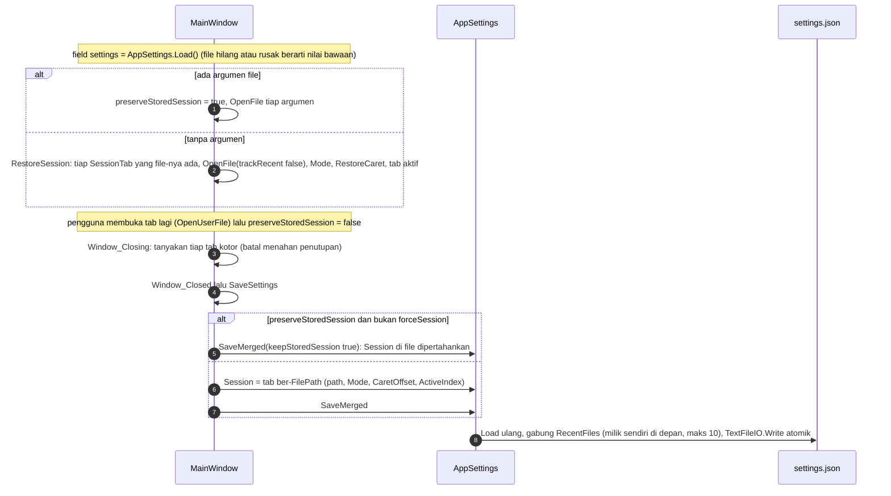
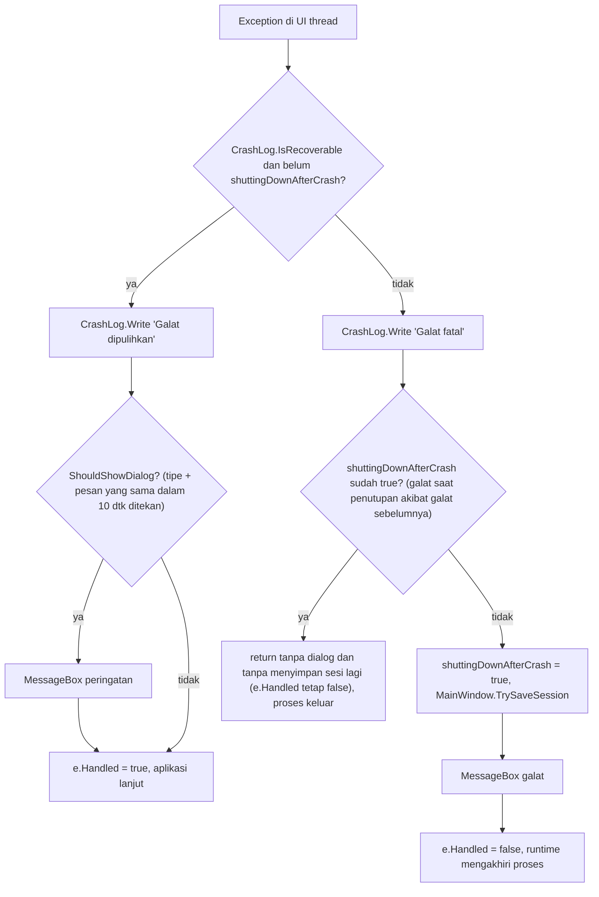
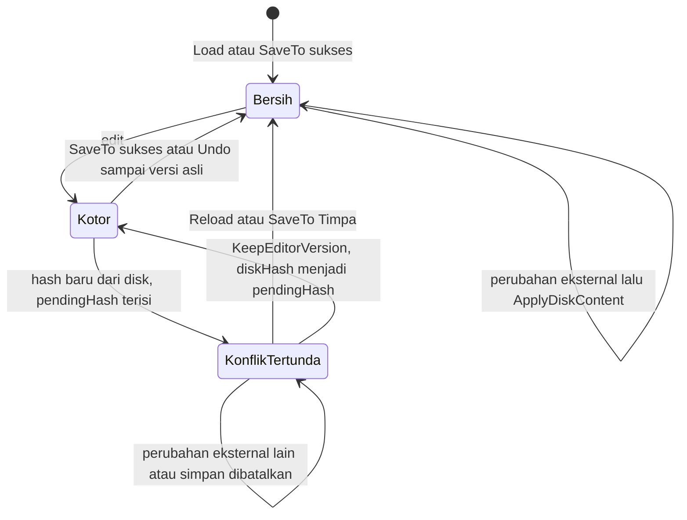

# Arsitektur MdViewer

**Tujuan:** menjelaskan komponen, tanggung jawabnya, alur utama, model thread, dan model state MdViewer.
**Pembaca:** pengembang yang akan mengubah kode `src/MdViewer`. Untuk alasan di balik keputusan lihat
[DESIGN-DECISIONS.md](DESIGN-DECISIONS.md); untuk batas keamanan lihat [SECURITY.md](SECURITY.md).

Konvensi rujukan: `berkas:baris` relatif terhadap akar repo; nomor baris sesuai kode saat dokumen ini ditulis dan bisa
bergeser. Pernyataan yang tidak bisa dibuktikan dari kode ditandai "belum diverifikasi".

## 1. Gambaran umum

- Aplikasi WPF .NET 9 (`net9.0-windows`, `WinExe`, Nullable + ImplicitUsings) - `src/MdViewer/MdViewer.csproj:4-12`.
- Pustaka pihak ketiga hanya dua: AvalonEdit 6.3.1.120 (editor) dan Markdig.Wpf 0.5.0.1 (parser Markdown + render
  `FlowDocument`) - `MdViewer.csproj:35-36`.
- Satu jendela (`MainWindow`) berisi banyak tab; satu tab = satu `DocumentTab` (model) dengan satu `DocumentView`
  (tampilan: editor + pratinjau + panel cari).
- Tidak ada `StartupUri`; `App.OnStartup` membuat `MainWindow` sendiri setelah urusan single-instance selesai
  (`src/MdViewer/App.xaml`, `src/MdViewer/App.xaml.cs:40`).
- Proyek test melihat tipe `internal` lewat `InternalsVisibleTo("MdViewer.Tests")` (`src/MdViewer/AssemblyInfo.cs:4`).

## 2. Komponen dan tanggung jawab

| Komponen | Berkas | Tanggung jawab |
| --- | --- | --- |
| `App` | `App.xaml(.cs)` | Titik masuk. Memasang penangan galat global (`DispatcherUnhandledException`, `AppDomain.UnhandledException`), mengubah argumen jadi path mutlak, memanggil `SingleInstance`, membuat `MainWindow`, menerima kiriman file dari instance lain (`OnFilesFromOtherInstance`), memutuskan galat dipulihkan atau fatal (`OnDispatcherUnhandledException`). |
| `MainWindow` | `MainWindow.xaml(.cs)` | Orkestrator UI: koleksi tab, menu/toolbar/pintasan (`CommandBinding`), dialog (buka/simpan, konfirmasi ukuran file, konflik), sesi dan berkas terakhir, zoom, tema, seret-lepas, ekspor HTML dan cetak. Satu-satunya jalur membuka dokumen: `OpenFile`. Memegang antrean konflik (`conflictQueue`, `conflictPromptOpen`) dan `preserveStoredSession`. |
| `DocumentTab` | `DocumentTab.cs` | Model satu dokumen: `TextDocument` (+ `UndoStack`), path, `Encoding`, `IsLossyDecoded`, hash/stempel file di disk (`diskHash`, `diskStamp`, `pendingHash`, `pendingStamp`), `FileSystemWatcher`, `SaveTo`, `Reload`, `CheckExternalChange`, `ExportHtml`. Memuat enum `ViewMode`, `SaveConflictChoice`, dan `ExternalChangeException`. |
| `DocumentView` | `DocumentView.xaml(.cs)` | Tampilan satu tab: editor AvalonEdit, pratinjau `FlowDocumentScrollViewer`, `FindReplaceBar`; debounce + parse latar + pengecekan generasi untuk render pratinjau; sinkron scroll; statistik kata; zoom; tema editor; penanganan klik tautan; `BuildPrintDocument`; `Dispose()` menghentikan timer. Memegang flag statis `BlockRemoteImages`. |
| `FindReplaceBar` + `SearchResultsRenderer` | `FindReplaceBar.xaml(.cs)` | Panel cari/ganti inline (satu per `DocumentView`), debounce input 250 ms dan refresh 150 ms, penanda hasil digambar `SearchResultsRenderer` (`IBackgroundRenderer`), Ganti Semua sebagai satu Undo. Mencegah pola regex yang sudah kena batas waktu dijalankan ulang (`timedOutKey`). |
| `SearchEngine` | `SearchEngine.cs` | Logika cari/ganti murni (tanpa UI): `FindAll`, `TryFindAll`, `ReplaceAll`, indeks navigasi, `NormalizeLineEndings` (regex sadar CRLF), batas waktu regex, `MaxResults`. |
| `MarkdownEditing` | `MarkdownEditing.cs` | Operasi format Markdown pada `TextDocument` (tebal, miring, kode, heading, daftar, kutipan, tautan, gambar); tiap operasi dibungkus `BeginUpdate` = satu langkah Undo. `Apply(TextEditor, ...)` adalah adaptor ke editor. |
| `TextFileIO` | `TextFileIO.cs` | Baca byte tanpa mengunci, deteksi/encode encoding, penulisan atomik (`Write`, `WriteBytesAtomic`, fallback `WriteInPlace`), SHA-256 (`Hash`), `ResolveLinkTarget` (symlink). |
| `FileStamp` | `FileStamp.cs` | `record struct` ukuran + waktu tulis + waktu pengambilan; `IsReliable` (jendela "racy" 2 dtk) dan `SameFileAs`; jalan pintas agar file yang jelas tak berubah tidak dibaca/di-hash ulang. |
| `AppSettings` (+ `SessionState`, `SessionTab`) | `AppSettings.cs` | Pengaturan JSON di `%APPDATA%\MdViewer\settings.json`: tema, zoom, blokir gambar remote, berkas terakhir, sesi. `Load`/`Save` tidak melempar; `SaveMerged` menggabungkan `RecentFiles` dengan isi file; `Sanitize` merapikan data rusak. |
| `SingleInstance` | `SingleInstance.cs` | `Mutex` `Local\` per sesi Windows menentukan instance utama; named pipe (`CurrentUserOnly`) meneruskan path absolut dari peluncuran berikutnya. Tidak pernah melempar; gagal berarti jatuh ke instance baru. |
| `MarkdownSupport` | `MarkdownSupport.cs` | Dua pipeline Markdig terpisah (`Pipeline` pratinjau, `ExportPipeline` ekspor), `ClassifyUrl`/`UrlKind` (allowlist), `ResolveImageUrls` (pratinjau/cetak), `SanitizeForExport` + `ImageEmbedder` (ekspor), `IsAllowedLocalPath`, `ResolveLinkTarget` (path tautan dokumen, tanpa I/O). |
| `AnchorHeadingRenderer` | `AnchorHeadingRenderer.cs` | Pengganti `HeadingRenderer` Markdig.Wpf yang menyimpan id heading (slug GitHub) di `Paragraph.Tag` agar pratinjau bisa melompat ke `#anchor` (`DocumentView.FindHeading`). Dipasang di `DocumentView.BuildFlowDocument`. |
| `HtmlExporter` | `HtmlExporter.cs` | Ekspor ke satu file HTML mandiri: parse dengan `ExportPipeline`, `SanitizeForExport`, render, template CSS tertanam, tulis atomik UTF-8 tanpa BOM. |
| `ThemeManager` + `AppThemeMode` | `Theming.cs` | Menukar `ResourceDictionary` `Themes/Light.xaml`/`Dark.xaml` di `Application.Resources`, mengikuti pengaturan sistem (HKCU `AppsUseLightTheme` + `SystemEvents.UserPreferenceChanged`), title bar gelap (`DwmSetWindowAttribute`), `LoadDictionary` (dipakai cetak). |
| `EditorTheme` | `EditorTheme.cs` | Mewarnai definisi highlighting "MarkDown" AvalonEdit dari brush `Syntax*Brush` dan menjaga kontras >= 4,5:1 terhadap latar editor (`EnsureContrast`, rumus WCAG). |
| `CrashLog` | `CrashLog.cs` | Catatan galat `%LOCALAPPDATA%\MdViewer\crash.log` (batas 512 KB), `IsRecoverable` (galat yang aman dilanjutkan), `ShouldShowDialog` (redam dialog berulang 10 dtk). Menulis log tidak pernah melempar. |
| `ChoiceDialog` + `DialogChoice<T>` | `ChoiceDialog.xaml(.cs)` | Dialog modal bertema dengan tombol berlabel; Esc/X = `cancelValue`. Dipakai untuk semua dialog konflik. |
| `AppCommands` | `AppCommands.cs` | `RoutedUICommand` khusus aplikasi (zoom, ekspor, cari berikutnya/sebelumnya, tema, format) + `FormatOf`. |
| Utilitas kecil | `ZoomLevel.cs`, `TextStats.cs`, `EncodingNames.cs`, `MarkdownFiles.cs`, `Converters.cs`, `ViewModeConverter.cs`, `NotNullConverter.cs` | Aturan zoom 50-300%, hitung kata/karakter per potongan 64 KB, label encoding status bar, daftar ekstensi Markdown (`.md .markdown .mdown .mkd .txt`), konverter binding. |
| Tema XAML | `Themes/Light.xaml`, `Dark.xaml`, `Controls.xaml`, `Preview.xaml` | `Light`/`Dark`: 43 brush semantik dengan kunci identik. `Controls`: gaya kontrol (semua warna `DynamicResource`). `Preview`: menimpa gaya `Styles.*` Markdig.Wpf untuk `FlowDocument`. Digabung di `App.xaml`. |

## 3. Diagram komponen

Panah = "memakai". Hanya dependensi yang terlihat di kode; AvalonEdit, Markdig.Wpf, dan API sistem digambar sebagai
kotak luar.

Catatan arah dependensi:

- `DocumentTab` membuat `DocumentView` di konstruktornya (`DocumentTab.cs:67`) dan `DocumentView` memegang referensi balik
  ke `DocumentTab` (untuk `Document`, `Mode`, `FilePath`, `SetCaret`, `SetStats`, `RequestOpen`). Keduanya sepasang.
- `MainWindow` tidak pernah menyentuh `TextFileIO`/`FileStamp` langsung; semua I/O dokumen lewat `DocumentTab`.
- `AppSettings.ParsedTheme` memakai `ThemeManager.Parse` (`AppSettings.cs:53`), jadi `AppSettings` bergantung pada `Theming.cs`.
- `MarkdownSupport` memakai `TextFileIO.ReadBytes`/`ResolveLinkTarget` untuk menyematkan gambar (`MarkdownSupport.cs:333,340`).

## 4. Alur utama

### 4.1 Startup dan single-instance

Kode: `App.xaml.cs:11-45`, `SingleInstance.cs:41-58, 85-133, 163-201`, `MainWindow.xaml.cs:36-60`.

Hal yang perlu diketahui:

- Bila mutex tidak bisa dibuat, `Create` mengembalikan `IsPrimary = true` tanpa mutex; `StartServer` lalu tidak berbuat apa-apa
  karena `mutex is null` (`SingleInstance.cs:56, 87`). Aplikasi tetap jalan, hanya tanpa single-instance.
- `window.Closed += singleInstance.Dispose` didaftarkan setelah `MainWindow` mendaftarkan `Window_Closed` sendiri, sehingga sesi
  disimpan dulu baru server berhenti (`App.xaml.cs:41-43`, `MainWindow.xaml.cs:54`).
- Instance utama yang sedang menutup mengabaikan kiriman file (`closing`/`closed`, `MainWindow.xaml.cs:65`).

### 4.2 Buka file

Kode: `MainWindow.OpenFile` (`MainWindow.xaml.cs:236-275`), `DocumentTab.Load` (`DocumentTab.cs:135-141`), `TextFileIO.ReadBytes/Decode`.

`OpenFile` tidak memeriksa ekstensi; penyaringan ekstensi hanya di seret-lepas (`Window_PreviewDrop`), klik tautan
relatif (`DocumentView.OnHyperlink` memakai `MarkdownSupport.ResolveLinkTarget`), dan filter dialog. Ekstensi yang diterima adalah `MarkdownFiles.IsMarkdown`
(`.md .markdown .mdown .mkd .txt`); asosiasi file (skrip) hanya `.md`/`.markdown`.

### 4.3 Edit, lalu render pratinjau (debounce, parse latar, generation check)

Kode: `DocumentView.xaml.cs:91-102, 326-446`.

Poin penting:

- `CreateFlowDocument` wajib di UI thread; hanya parse + `ResolveImageUrls` yang pindah ke thread latar (komentar di
  `DocumentView.xaml.cs:389`).
- Teks dokumen dan nilai `BlockRemoteImages` diambil di UI thread sebelum `Task.Run` (`:339, 348`), sehingga thread latar tidak
  membaca state UI.
- `Dispose()` menaikkan `renderGeneration`, jadi hasil latar yang tiba sesudah tab ditutup dibuang (`:134`; test
  `BackgroundRender_AfterDispose_IsDiscarded_AndNothingIsShown`).
- Galat render dicatat ke `CrashLog` dan pratinjau diganti dokumen pesan galat; isi file tidak tersentuh (`ShowRenderError`,
  `CreateFlowDocument`, `ReplaceUnloadableImages`). `OutOfMemoryException` diperlakukan berbeda per jalur: pada render sinkron
  (< 100 rb karakter, `DocumentView.xaml.cs:358`) OOM sengaja lolos dan menjadi galat fatal; di `RenderInBackground` (`:400`)
  semua galat termasuk OOM ditangkap dan ditampilkan sebagai dokumen galat.

### 4.4 Simpan (atomik, deteksi konflik)

Kode: `MainWindow.Save/SaveAs/TrySave` (`:403-448`), `DocumentTab.SaveTo/SaveCore` (`:149-200`),
`TextFileIO.Write/WriteBytesAtomic` (`:134-202`).

Galat `IOException`/`UnauthorizedAccessException` dari `SaveTo` ditangkap `TrySave` dan ditampilkan; tab tetap kotor
dengan path lama.

### 4.5 Perubahan file dari luar (watcher, hash/FileStamp, antrean konflik, dialog)

Kode: `DocumentTab.cs:227-277, 347-391`, `MainWindow.xaml.cs:53, 316-366`.

Tab yang ditutup atau yang konfliknya sudah selesai (`HasExternalConflict == false`) dilewati saat antrean diproses
(`MainWindow.xaml.cs:334`).

### 4.6 Ekspor HTML

Kode: `MainWindow.ExportHtml_Executed` (`:551-581`), `DocumentTab.ExportHtml`, `HtmlExporter.ToHtmlDocument/ExportToFile`,
`MarkdownSupport.SanitizeForExport`.

Ekspor memakai teks editor saat ini (termasuk yang belum disimpan), bukan versi di disk.

### 4.7 Pemulihan dan penyimpanan sesi

Kode: `MainWindow.xaml.cs:36-60, 187-232, 686-706`, `AppSettings.SaveMerged` (`AppSettings.cs:96-107`).

Hanya tab yang punya path yang masuk sesi; dokumen "Tanpa Judul" dan isi yang belum disimpan tidak dipulihkan
(README, bagian Batasan). Pada galat fatal `TrySaveSession` memaksa penyimpanan sesi (`forceSession: true`).

### 4.8 Penanganan galat

Kode: `App.xaml.cs:64-102` (cabang `shuttingDownAfterCrash`: `:67, 75`), `CrashLog.cs:58-91`.

## 5. Model thread

| Pekerjaan | Thread | Bukti |
| --- | --- | --- |
| Semua UI, `DocumentTab`, `DocumentView`, `FindReplaceBar`, `MainWindow` | UI thread (Dispatcher WPF) | `DocumentTab` menangkap `Dispatcher.CurrentDispatcher` saat dibuat (`DocumentTab.cs:26`) |
| Timer: `renderTimer`, `statsTimer` (`DocumentView`), `changeTimer` (`DocumentTab`), `queryTimer`, `refreshTimer` (`FindReplaceBar`) | UI thread (`DispatcherTimer`) | `DocumentView.xaml.cs:32-33`, `DocumentTab.cs:27,69`, `FindReplaceBar.xaml.cs:22-23` |
| Baca/hash/tulis file dokumen, ekspor, cetak, `CheckExternalChange` | UI thread, sinkron | tidak ada `Task.Run` di `DocumentTab`/`HtmlExporter`/`MainWindow`; satu-satunya `Task.Run` untuk dokumen adalah parse pratinjau |
| Parse Markdig + `ResolveImageUrls` untuk dokumen 100 rb karakter atau lebih | Thread pool; hasil dilanjutkan di UI thread (`await` tanpa `ConfigureAwait(false)`) | `DocumentView.xaml.cs:27, 395` |
| Pembuatan `FlowDocument` (`CreateFlowDocument`) | UI thread (wajib) | komentar `DocumentView.xaml.cs:389` |
| Event `FileSystemWatcher` | Thread pool, dipindah ke UI lewat `dispatcher.BeginInvoke` | `DocumentTab.cs:383-391` |
| Loop server pipe `SingleInstance` | Thread pool (`Task.Run`, `ConfigureAwait(false)`); callback `onFiles` di thread latar, lalu `Dispatcher.BeginInvoke` | `SingleInstance.cs:90-151`, `App.xaml.cs:57-58` |
| `SystemEvents.UserPreferenceChanged` (tema Ikuti Sistem) | Dipindah ke UI lewat `BeginInvoke` | `Theming.cs:103-110` |
| `CrashLog.Write` | Thread mana pun; diserialisasi `lock (Gate)` | `CrashLog.cs:17,34` |

Konsekuensi: operasi I/O besar (muat file ratusan MB, ekspor dengan banyak gambar, hash saat stempel "racy") membekukan UI selama
berjalan; batas ukuran dan anggaran ekspor ada untuk membatasi ini. Regex cari juga sinkron di UI thread, dibatasi 2 dtk per
kecocokan dan 4 dtk total (`SearchEngine.cs:24-25`). Keamanan-thread `MarkdownSupport.Pipeline` (statis, dipakai thread latar dan
UI) belum diverifikasi.

## 6. Model state

### 6.1 `DocumentTab`

| State | Arti | Diubah oleh |
| --- | --- | --- |
| `IsDirty` | Turunan `!Document.UndoStack.IsOriginalFile`. Bukan flag sendiri: Undo sampai versi asli membuat tab bersih lagi. | Edit, Undo, `MarkAsOriginalFile` di `SaveCore` dan `ApplyDiskContent` |
| Undo | Reload (otomatis maupun pilihan pengguna) = `StartUndoGroup` + `Replace` + `EndUndoGroup` + `MarkAsOriginalFile`: tab bersih, tetapi Undo masih mengembalikan teks editor lama (lalu tab kotor) | `ApplyDiskContent` (`DocumentTab.cs:325-345`) |
| `diskHash`, `diskStamp` | Isi/stempel file yang terakhir diketahui sama dengan di disk | Hanya di `Load`, `SaveCore`, `ApplyDiskContent`, `KeepEditorVersion`, dan penyegaran stempel di `CheckExternalChange`/`IsChangedOnDisk` saat hash tidak berubah. `null` untuk tab tanpa judul: tidak ada pemeriksaan eksternal dan tidak ada konflik simpan |
| `pendingHash`, `pendingStamp` | Perubahan eksternal yang sudah dilaporkan (`ExternalChangeConflict`) tetapi belum dijawab; `HasExternalConflict = pendingHash is not null`. `diskHash` sengaja tidak diubah sampai ada jawaban, supaya simpan berikutnya tetap mendeteksi konflik | `CheckExternalChange` mengisi; `SaveCore`, `ApplyDiskContent`, `KeepEditorVersion`, atau hash kembali sama menghapus |
| `saving` | `true` selama `SaveTo` (termasuk dialog konflik simpan yang memompa pesan): `CheckExternalChange` ditunda supaya tidak ada dialog konflik kedua | `SaveTo` (`try/finally`) |
| `IsLossyDecoded` | File ber-BOM berisi byte tak valid yang diganti U+FFFD; simpan meminta konfirmasi | `Load`, `ApplyDiskContent` mengisi; `SaveCore` menghapus |
| `Encoding` | Encoding yang dipakai saat menyimpan; bisa naik ke UTF-8 saat simpan | `Load`, `SaveCore`, `ApplyDiskContent` |
| `disposed`, `changeRetries` | Penjaga siklus hidup; batas percobaan baca file terkunci (5, termasuk baca awal) | `Dispose`; `OnDiskEvent` mereset hitungan |

### 6.2 `MainWindow`

| State | Arti |
| --- | --- |
| `conflictQueue` + `conflictPromptOpen` | Satu dialog konflik pada satu waktu. Dialog bersifat modal tetapi memompa pesan, sehingga konflik tab lain datang saat dialog terbuka; itu hanya masuk antrean dan diproses setelah dialog tertutup (`MainWindow.xaml.cs:316-342`). `OnSaveConflict` memakai penanda yang sama dan memulihkan nilai lamanya (`:371-392`). |
| `preserveStoredSession` | `true` bila instance dibuka dengan argumen file: saat keluar `Session` di `settings.json` tidak ditimpa. Menjadi `false` begitu `OpenUserFile` benar-benar mengembalikan tab (kiriman instance lain, dialog Buka, seret-lepas, Berkas Terakhir). Pemulihan sesi dan argumen startup memakai `OpenFile` langsung sehingga tidak "mengadopsi". `forceSession` (galat fatal) mengabaikannya. |
| `closing`, `closed` | `closing`: penutupan sedang berjalan; direset bila pengguna membatalkan. Efeknya hanya dua: `ProcessConflictQueue` di `finally` milik `TrySave` dilewati (`MainWindow.xaml.cs:446`) dan kiriman file dari instance lain diabaikan (`:65`, bersama `closed`). `closed`: setelah `Window_Closed`. |
| `zoomPercent`, tema | Disalin ke `AppSettings` saat `SaveSettings`. |

### 6.3 `DocumentView`

`previewStale`, `lastRenderedText` (tidak disimpan bila 1 juta karakter atau lebih), `lastRenderedVersion`, `renderGeneration`,
`renderInFlight`, `pendingAnchor` (anchor yang menunggu render selesai), `expectedEditorOffset`/`expectedPreviewOffset`/
`scrollSyncSuspended` (mencegah umpan balik sinkron scroll), `disposed`. Flag statis `BlockRemoteImages` berlaku untuk semua tab
dan diubah dari `MainWindow` (`LoadRemoteImages_Click`) diikuti `RefreshPreview` pada tiap tab.

### 6.4 `AppSettings`

`removedRecent` (berkas yang sengaja dihapus instance ini dari daftar terakhir, supaya tidak "hidup lagi" saat digabung dengan
isi file) bersifat per-instance dan tidak disimpan. Data yang disimpan: `Theme` dan `SessionTab.Mode` sebagai teks agar nilai
tak dikenal tidak merusak seluruh file (`Sanitize` + `ParsedMode` jatuh ke default).
