# Makdon Architecture

**Purpose:** describes the components, their responsibilities, the main flows, the thread model, and the state model of Makdon.
**Audience:** developers who will change the code in `src/Makdon`. For the reasoning behind the decisions see
[DESIGN-DECISIONS.md](DESIGN-DECISIONS.md); for the security boundaries see [SECURITY.md](SECURITY.md).

Reference convention: `file:line` is relative to the repo root; line numbers match the code at the time this document was written and may shift. Statements that cannot be proven from the code are marked "not verified".

## 1. Overview

- WPF application for .NET 10 (`net10.0-windows`, `WinExe`, Nullable + ImplicitUsings) - `src/Makdon/Makdon.csproj:5`.
- Only two third-party libraries: AvalonEdit 6.3.1.120 (editor) and Markdig.Wpf 0.5.0.1 (Markdown parser + `FlowDocument` renderer) - `Makdon.csproj:45-46`.
- One window (`MainWindow`) holds many tabs; one tab = one `DocumentTab` (model) with one `DocumentView` (view: editor + preview + find panel).
- There is no `StartupUri`; `App.OnStartup` creates `MainWindow` itself after single-instance handling is done
  (`src/Makdon/App.xaml`, `src/Makdon/App.xaml.cs:42`).
- The test project sees `internal` types through `InternalsVisibleTo("Makdon.Tests")` (`src/Makdon/AssemblyInfo.cs:4`).
- Printing has two paths that share `PageLayout` and `HeaderFooterPaginator`: direct print (Ctrl+P, synchronous) and Print Preview
  (Ctrl+Shift+P, modal; pages are laid out asynchronously into an in-memory XPS package, then printed from that package). See 4.9 and 4.10.

## 2. Components and responsibilities

| Component | File | Responsibility |
| --- | --- | --- |
| `App` | `App.xaml(.cs)` | Entry point. Installs the global error handlers (`DispatcherUnhandledException`, `AppDomain.UnhandledException`), converts arguments to absolute paths, calls `SingleInstance`, creates `MainWindow`, receives file hand-offs from other instances (`OnFilesFromOtherInstance`), and decides whether an error is recovered or fatal (`OnDispatcherUnhandledException`). Installed mode: calls `InstallerMutex.Acquire` (`App.xaml.cs:23`); the single-instance scope is taken from `AppPaths.Current.SingleInstanceScope` (`App.xaml.cs:24`). |
| `MainWindow` | `MainWindow.xaml(.cs)` | UI orchestrator: tab collection, menu/toolbar/shortcuts (`CommandBinding`), dialogs (open/save, file-size confirmation, conflict), session and recent files, zoom, theme, drag-and-drop, HTML export, direct print (`Print_Executed`, Ctrl+P) and opening the modal Print Preview (`PrintPreview_Executed`, Ctrl+Shift+P). The only path for opening documents: `OpenFile`. Holds the conflict queue (`conflictQueue`, `conflictPromptOpen`) and `preserveStoredSession`. Portable mode only: the `Berkas > Integrasi Explorer` (File > Explorer Integration) menu (`FileAssociation`) and the startup checks (`RunPortableStartupChecks`, scheduled from `ContentRendered` at `ApplicationIdle` priority). `Bantuan > Tentang Makdon` (Help > About Makdon) (`About_Click`) is available in all modes. |
| `DocumentTab` | `DocumentTab.cs` | Model of one document: `TextDocument` (+ `UndoStack`), path, `Encoding`, `IsLossyDecoded`, hash/stamp of the file on disk (`diskHash`, `diskStamp`, `pendingHash`, `pendingStamp`), `FileSystemWatcher`, `SaveTo`, `Reload`, `CheckExternalChange`, `ExportHtml`. Contains the enums `ViewMode`, `SaveConflictChoice`, and the `ExternalChangeException` type. |
| `DocumentView` | `DocumentView.xaml(.cs)` | View of one tab: AvalonEdit editor, `FlowDocumentScrollViewer` preview, `FindReplaceBar`; debounce + background parse + generation check for preview rendering; scroll sync; word statistics; zoom; editor theme; hyperlink click handling; `Dispose()` stops the timers. Print side: `CapturePrintSnapshot` (copy of the text + document folder + remote-block flag + title), `BuildPrintDocument` (Light-theme document; `internal` static variants from a snapshot or from the AST), `ParsePrintSnapshot`, and `CreateFlowDocument(throwOnFailure)`; also forwards the `Print` command from the `Preview` panel to the window path (see 4.9). Holds the static flag `BlockRemoteImages`. |
| `FindReplaceBar` + `SearchResultsRenderer` | `FindReplaceBar.xaml(.cs)` | Inline find/replace panel (one per `DocumentView`), 250 ms input debounce and 150 ms refresh, result markers drawn by `SearchResultsRenderer` (`IBackgroundRenderer`), Replace All as a single Undo. Prevents a regex pattern that already hit the time limit from being run again (`timedOutKey`). |
| `SearchEngine` | `SearchEngine.cs` | Pure find/replace logic (no UI): `FindAll`, `TryFindAll`, `ReplaceAll`, navigation index, `NormalizeLineEndings` (CRLF-aware regex), regex time limits, `MaxResults`. |
| `MarkdownEditing` | `MarkdownEditing.cs` | Markdown formatting operations on a `TextDocument` (bold, italic, code, heading, list, quote, link, image); each operation is wrapped in `BeginUpdate` = one Undo step. `Apply(TextEditor, ...)` is the adapter to the editor. |
| `TextFileIO` | `TextFileIO.cs` | Read bytes without locking, detect/encode encodings, atomic writes (`Write`, `WriteBytesAtomic`, fallback `WriteInPlace`), SHA-256 (`Hash`), `ResolveLinkTarget` (symlinks). |
| `FileStamp` | `FileStamp.cs` | `record struct` of size + write time + capture time; `IsReliable` (the 2-second "racy" window) and `SameFileAs`; a shortcut so that files that are clearly unchanged are not read or re-hashed. |
| `AppSettings` (+ `SessionState`, `SessionTab`) | `AppSettings.cs` | JSON settings in `%APPDATA%\Makdon\settings.json`: theme, zoom, block remote images, recent files, session. `Load`/`Save` do not throw; `SaveMerged` merges `RecentFiles` with the file contents; `Sanitize` repairs corrupt data. The location comes from `AppPaths.SettingsPath` (`%APPDATA%\Makdon\`, or `<exe folder>\data\` for portable; `AppSettings.cs:59`). |
| `SingleInstance` | `SingleInstance.cs` | A `Local\` `Mutex` per Windows session decides the primary instance; a named pipe (`CurrentUserOnly`) forwards absolute paths from later launches. Never throws; on failure it falls back to a new instance. The `scope` parameter separates the mutex and pipe names (empty for installed; a hash of the exe folder for portable, `SingleInstance.cs:41-44`). |
| `AppPaths` | `AppPaths.cs` | Installed/portable mode: portable when a `Makdon.portable` file exists next to the exe (`Detect`, `AppPaths.cs:60-65`). Provides `SettingsPath`, `CrashLogPath`, `SingleInstanceScope` (hash of the exe folder, portable only), and `IsDataDirectoryWritable` (write test; creates `data\` if needed). `Current` is filled once at startup. The folder and the marker checker can be injected for tests. |
| `AppInfo` | `AppInfo.cs` | Identity constants: `InstallerAppId` (Inno GUID; must not change), installer mutex name, `ReleasesUrl`, `LicenseName`, and `Version` (`InformationalVersion` without the `+hash` suffix). |
| `InstallerMutex` | `InstallerMutex.cs` | Creates the fixed named mutex `Makdon.AppMutex` (local and `Global\`) that the installer/uninstaller checks. Installed mode only; held for the whole process; errors are ignored. |
| `IRegistryStore` + `WindowsRegistryStore` | `RegistryStore.cs` | Read/write seam for the registry used by `FileAssociation`. The real implementation always uses the 64-bit view (HKCU/HKLM). Tests use `FakeRegistryStore`. |
| `FileAssociation` (+ `AssociationStatus`, `RegistrationKind`, `RegisterResult`, `UnregisterResult`, `StartupIssue`) | `FileAssociation.cs` | Portable-mode registration of `Buka dengan` (`Open with`) in HKCU (registry table in `DISTRIBUTION.md` 4.1). `FindInstallation` (Inno `_is1` key in HKCU/HKLM), `GetStatus` (classifies the registered exe), `Register` (refuses if installed; asks if another exe is registered), `Unregister` (only if it belongs to this exe), `CheckStartup`. Calls `SHChangeNotify` after writing. |
| `MarkdownSupport` | `MarkdownSupport.cs` | Two separate Markdig pipelines (`Pipeline` for preview, `ExportPipeline` for export), `ClassifyUrl`/`UrlKind` (allowlist), `ResolveImageUrls` (preview/print), `SanitizeForExport` + `ImageEmbedder` (export), `IsAllowedLocalPath`, `ResolveLinkTarget` (document link path, no I/O). |
| `AnchorHeadingRenderer` | `AnchorHeadingRenderer.cs` | Replacement for the Markdig.Wpf `HeadingRenderer` that stores the heading id (GitHub slug) in `Paragraph.Tag` so the preview can jump to `#anchor` (`DocumentView.FindHeading`). Installed in `DocumentView.BuildFlowDocument`. |
| `HtmlExporter` | `HtmlExporter.cs` | Exports to a single self-contained HTML file: parse with `ExportPipeline`, `SanitizeForExport`, render, embedded CSS template, atomic UTF-8 write without BOM. |
| Print model: `PageLayout`, `PrintSnapshot`, `PrintSource`, `PrintService` (+ enums `PaperKind`, `PrintOrientation`, `MarginPreset`) | `PrintLayout.cs` | `PrintSnapshot` = copy of the tab contents when the preview is opened. `PageLayout` = the only place that derives `PageWidth`/`PageHeight`/`ColumnWidth`/`PagePadding` (A4/Letter x portrait/landscape x margins 0.5"/0.75"/1"; `FromPrintableArea` rejects unreasonable sizes). `PrintSource` (`internal`) = Markdown parse result of one snapshot, reused between cycles (on a background thread when the text is >= `DocumentView.BackgroundParseChars`). `PrintService` = `CreateDocument`, `CreatePaginator` (+ footer), and `Print` (direct print). |
| `HeaderFooterPaginator` | `HeaderFooterPaginator.cs` | Wrapping `DocumentPaginator` (`internal`): draws the document name (left, truncated to one line) and "Halaman X dari N" / "Page X of N" (right) inside the bottom margin of each page without changing the pagination of the content. Used identically by the preview and by direct print. |
| `PreviewBuild` + `PreviewStage` | `PreviewBuild.cs` | One preview build cycle (`internal`, UI thread): `Paginating`, `Rendering`, then `Ready` or `Failed`. Background pagination of the FlowDocument, then the pages are written asynchronously to an in-memory XPS package (`PackageStore`) and exposed as a `FixedDocumentSequence`. All event handlers are wrapped in `Guard`; `Dispose()` cancels and schedules package cleanup. |
| `PrintPreviewWindow` | `PrintPreviewWindow.xaml(.cs)` | Modal window: themed `DocumentViewer`, options for orientation/paper/margin/footer (each change = a new `PreviewBuild` from the same `PrintSource`), page navigation, zoom, Print button (`PrintDialog` + `ConfirmPaperMatchesPreview`), and an error panel (`ShowFailure`). |
| `ThemeManager` + `AppThemeMode` | `Theming.cs` | Swaps the `ResourceDictionary` `Themes/Light.xaml`/`Dark.xaml` in `Application.Resources`, follows the system setting (HKCU `AppsUseLightTheme` + `SystemEvents.UserPreferenceChanged`), dark title bar (`DwmSetWindowAttribute`), `LoadDictionary` (used by print). |
| `EditorTheme` | `EditorTheme.cs` | Colors the AvalonEdit "MarkDown" highlighting definition from the `Syntax*Brush` brushes and keeps a contrast of >= 4.5:1 against the editor background (`EnsureContrast`, WCAG formula). |
| `CrashLog` | `CrashLog.cs` | Error log at `%LOCALAPPDATA%\Makdon\crash.log` (512 KB limit), `IsRecoverable` (errors that are safe to continue after), `ShouldShowDialog` (suppresses repeated dialogs within 10 s). Writing the log never throws. The location comes from `AppPaths.CrashLogPath` (`CrashLog.cs:25`; portable: `data\crash.log`). |
| `ChoiceDialog` + `DialogChoice<T>` | `ChoiceDialog.xaml(.cs)` | Themed modal dialog with labeled buttons; Esc/X = `cancelValue`. Used for all conflict dialogs. |
| `AppCommands` | `AppCommands.cs` | App-specific `RoutedUICommand`s (zoom, export, print preview, find next/previous, theme, format) + `FormatOf`. |
| Small utilities | `ZoomLevel.cs`, `TextStats.cs`, `EncodingNames.cs`, `MarkdownFiles.cs`, `Converters.cs`, `ViewModeConverter.cs`, `NotNullConverter.cs` | Zoom rules 50-300%, word/character count per 64 KB chunk, encoding labels for the status bar, list of Markdown extensions (`.md .markdown .mdown .mkd .txt`), binding converters. |
| XAML themes | `Themes/Light.xaml`, `Dark.xaml`, `Controls.xaml`, `Preview.xaml` | `Light`/`Dark`: 43 semantic brushes with identical keys. `Controls`: control styles (all colors are `DynamicResource`). `Preview`: overrides the Markdig.Wpf `Styles.*` styles for the `FlowDocument`. Merged in `App.xaml`. |

## 3. Component diagram

Arrows = "uses". Only dependencies visible in the code are shown; AvalonEdit, Markdig.Wpf, and system APIs are drawn as
outer boxes.

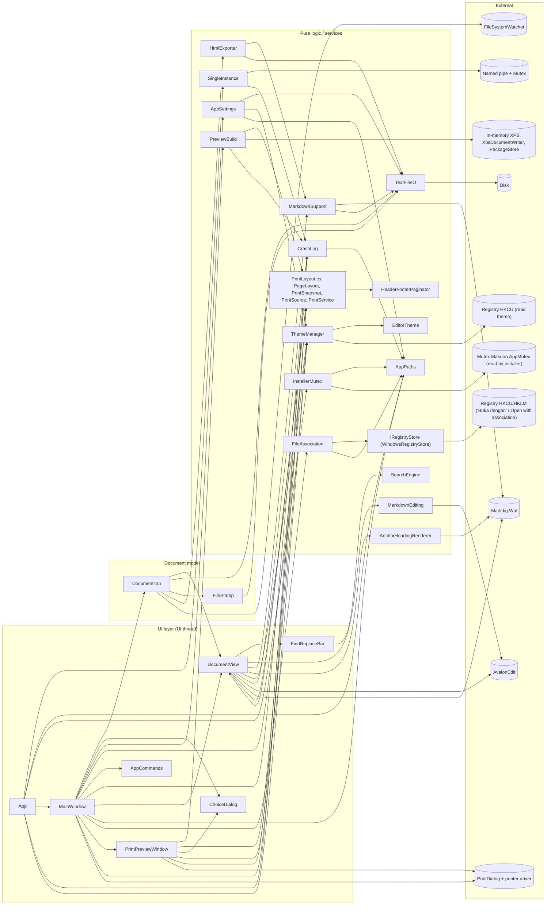

Notes on dependency direction:

- `DocumentTab` creates `DocumentView` in its constructor (`DocumentTab.cs:67`), and `DocumentView` holds a back-reference
  to `DocumentTab` (for `Document`, `Mode`, `FilePath`, `SetCaret`, `SetStats`, `RequestOpen`). The two are a pair.
- `MainWindow` never touches `TextFileIO`/`FileStamp` directly; all document I/O goes through `DocumentTab`.
- `AppSettings.ParsedTheme` uses `ThemeManager.Parse` (`AppSettings.cs:53`), so `AppSettings` depends on `Theming.cs`.
- `MarkdownSupport` uses `TextFileIO.ReadBytes`/`ResolveLinkTarget` to embed images (`MarkdownSupport.cs:333,340`).
- `PrintLayout.cs` and `DocumentView` depend on each other: `DocumentView.CapturePrintSnapshot` returns a `PrintSnapshot`, while
  `PrintSource`/`PrintService` call the `internal` statics `DocumentView.ParsePrintSnapshot`/`BuildPrintDocument`
  (`PrintLayout.cs:99,121,133`). `PrintPreviewWindow` and `PreviewBuild` do not touch `DocumentTab`/`DocumentView`: they only hold
  a `PrintSnapshot`, so closing or editing a tab does not change an open preview.
- The preview (`PreviewBuild`) and direct print (`PrintService.Print`) use the same `PageLayout.Apply` and
  `PrintService.CreatePaginator`, so their pagination and footers are identical (`PrintLayout.cs:73,142`; `MainWindow.xaml.cs:755-756`).

## 4. Main flows

### 4.1 Startup and single-instance

Code: `App.xaml.cs:11-47`, `SingleInstance.cs:41-58, 85-133, 163-201`, `MainWindow.xaml.cs:37-62`, `AppPaths.cs:67-75`, `InstallerMutex.cs:12-23`.

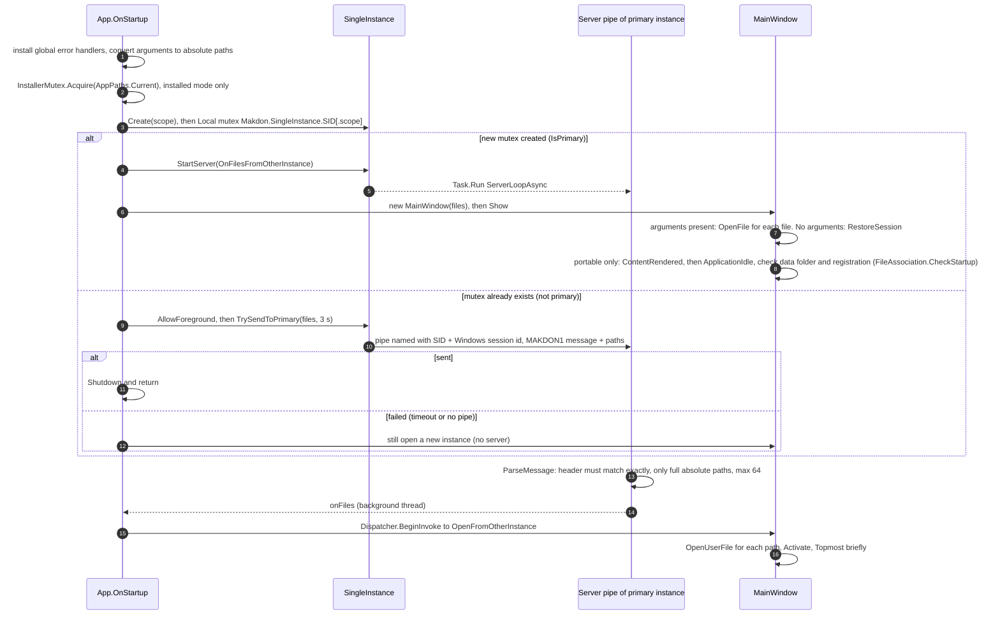

Things to know:

- If the mutex cannot be created, `Create` returns `IsPrimary = true` without a mutex; `StartServer` then does nothing
  because `mutex is null` (`SingleInstance.cs:56, 87`). The application still runs, just without single-instance behavior.
- `window.Closed += singleInstance.Dispose` is registered after `MainWindow` registers its own `Window_Closed`, so the session
  is saved first and only then the server stops (`App.xaml.cs:43-45`, `MainWindow.xaml.cs:56`).
- Portable mode uses a scope based on a hash of the exe folder (its pipe and mutex do not meet the installed instance);
  installed mode uses the default names and creates `Makdon.AppMutex` for the installer. The installer mutex is never created in portable mode.
- The portable startup checks (data folder writable, "Open with" registration stale or conflicting with an installation) are scheduled
  after the window is shown, so their dialogs do not hold up opening files (`MainWindow.xaml.cs:486-497`).
- A primary instance that is closing ignores file hand-offs (`closing`/`closed`, `MainWindow.xaml.cs:67`).

### 4.2 Open file

Code: `MainWindow.OpenFile` (`MainWindow.xaml.cs:238-277`), `DocumentTab.Load` (`DocumentTab.cs:135-141`), `TextFileIO.ReadBytes/Decode`.

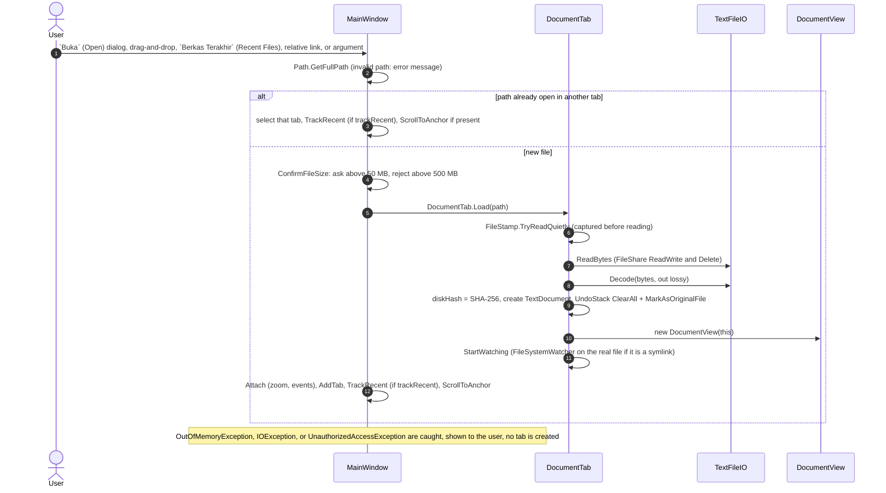

`OpenFile` does not check the extension; extension filtering happens only in drag-and-drop (`Window_PreviewDrop`), relative link
clicks (`DocumentView.OnHyperlink` uses `MarkdownSupport.ResolveLinkTarget`), and the dialog filter. The accepted extensions are
`MarkdownFiles.IsMarkdown` (`.md .markdown .mdown .mkd .txt`); the file association (script) covers only `.md`/`.markdown`.

### 4.3 Edit, then render preview (debounce, background parse, generation check)

Code: `DocumentView.xaml.cs:97-108, 332-452`.

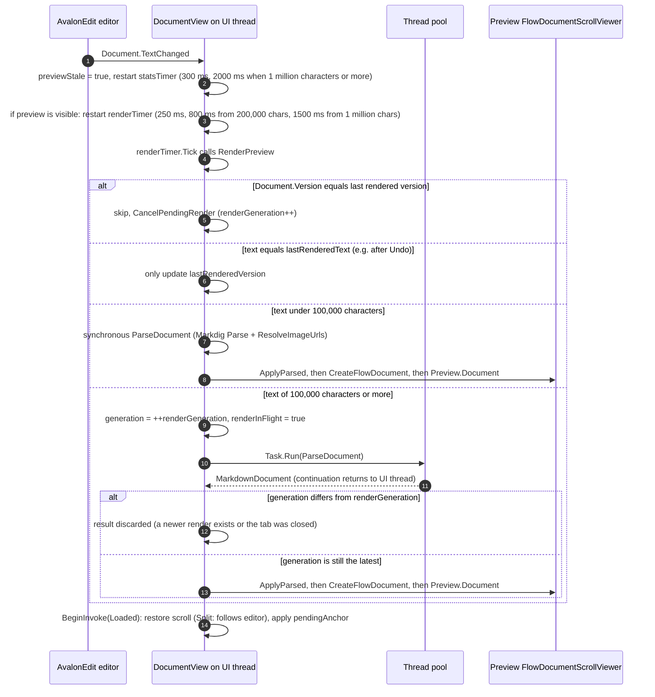

Key points:

- `CreateFlowDocument` must run on the UI thread; only the parse + `ResolveImageUrls` move to a background thread (comment in
  `DocumentView.xaml.cs:395`).
- The document text and the value of `BlockRemoteImages` are read on the UI thread before `Task.Run` (`:345, 354`), so the background
  thread does not read UI state.
- `Dispose()` increments `renderGeneration`, so a background result that arrives after the tab is closed is discarded (`:140`; test
  `BackgroundRender_AfterDispose_IsDiscarded_AndNothingIsShown`).
- Render errors are logged to `CrashLog` and the preview is replaced by an error document; the file contents are untouched (`ShowRenderError`,
  `CreateFlowDocument`, `ReplaceUnloadableImages`). `OutOfMemoryException` is handled differently per path: on the synchronous render
  (< 100,000 characters, `DocumentView.xaml.cs:364`) OOM is deliberately let through and becomes a fatal error; in `RenderInBackground` (`:406`)
  all errors including OOM are caught and shown as an error document. The print/print preview path differs: a final render failure is thrown
  (`CreateFlowDocument(throwOnFailure: true)`, `:459-483`) instead of being replaced by an error document, because the error document contains the
  `crash.log` path and must never reach paper (see 4.9 and [ADR-24](DESIGN-DECISIONS.md#adr-24-error-documents-are-never-printed)).

### 4.4 Save (atomic, conflict detection)

Code: `MainWindow.Save/SaveAs/TrySave` (`:403-448`), `DocumentTab.SaveTo/SaveCore` (`:149-200`),
`TextFileIO.Write/WriteBytesAtomic` (`:134-202`).

```mermaid
sequenceDiagram
    autonumber
    actor U as User
    participant M as MainWindow
    participant T as DocumentTab
    participant IO as TextFileIO
    participant D as ChoiceDialog

    U->>M: Ctrl+S
    M->>M: FilePath empty: SaveAs (SaveFileDialog, refuse if the path is used by another tab). Otherwise TrySave
    M->>M: IsLossyDecoded: MessageBox confirmation before continuing
    M->>T: SaveTo(path): saving = true, changeTimer.Stop
    T->>T: same path and diskHash exists: IsChangedOnDisk(path)
    Note right of T: reliable and equal stamps mean unchanged. Otherwise read the bytes and compare SHA-256 with diskHash
    alt content on disk differs
        T->>M: SaveConflict event (OnSaveConflict). Without a handler: ExternalChangeException
        M->>D: Timpa (Overwrite), Muat dari Disk (Reload from Disk), Batal (Cancel), default is Cancel
        D-->>M: choice
        alt Cancel
            T-->>M: false, nothing written
        else Reload from Disk
            T->>T: Reload() reads again now, one Undo step, then false
        else Timpa (Overwrite)
            T->>T: continue writing
        end
    end
    T->>IO: Write(path, Document.Text, Encoding)
    IO->>IO: Encode (BOM kept; if out of encoding range: fall back to UTF-8 without BOM)
    IO->>IO: WriteBytesAtomic: temp file ~md plus 8 hex .tmp (CreateNew), then Flush(true), then File.Replace or File.Move
    alt temp file cannot be created (UnauthorizedAccess or PathTooLong)
        IO->>IO: WriteInPlace (write from the start, then truncate; not atomic)
    end
    IO-->>T: (actual encoding, hash of the bytes written)
    T->>T: diskHash, diskStamp updated, pending cleared, IsLossyDecoded = false, MarkAsOriginalFile
    T->>T: StartWatching if the path changed, Raise FilePath/PathText/EncodingLabel only if changed
    M->>M: finally: ProcessConflictQueue (unless closing)
```

An `IOException`/`UnauthorizedAccessException` from `SaveTo` is caught by `TrySave` and shown; the tab stays dirty
with the old path.

### 4.5 External file changes (watcher, hash/FileStamp, conflict queue, dialog)

Code: `DocumentTab.cs:227-277, 347-391`, `MainWindow.xaml.cs:55, 318-368`.

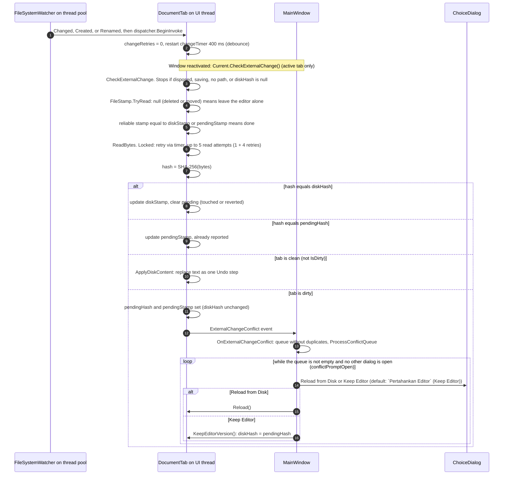

Tabs that were closed or whose conflict is already resolved (`HasExternalConflict == false`) are skipped when the queue is processed
(`MainWindow.xaml.cs:336`).

### 4.6 HTML export

Code: `MainWindow.ExportHtml_Executed` (`:551-581`), `DocumentTab.ExportHtml`, `HtmlExporter.ToHtmlDocument/ExportToFile`,
`MarkdownSupport.SanitizeForExport`.

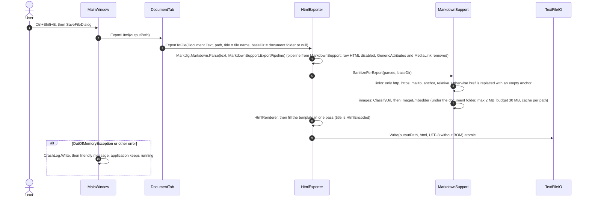

Export uses the current editor text (including unsaved changes), not the version on disk.

### 4.7 Session restore and save

Code: `MainWindow.xaml.cs:37-62, 189-234, 876-896`, `AppSettings.SaveMerged` (`AppSettings.cs:99-110`).

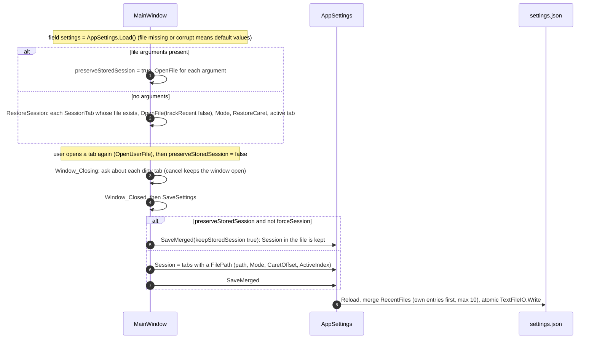

Only tabs with a path enter the session; `Tanpa Judul` (Untitled) documents and unsaved contents are not restored (README, Known limitations section).
On a fatal error `TrySaveSession` forces the session to be saved (`forceSession: true`).

### 4.8 Error handling

Code: `App.xaml.cs:66-104` (the `shuttingDownAfterCrash` branch: `:67, 75`), `CrashLog.cs:57-90`.

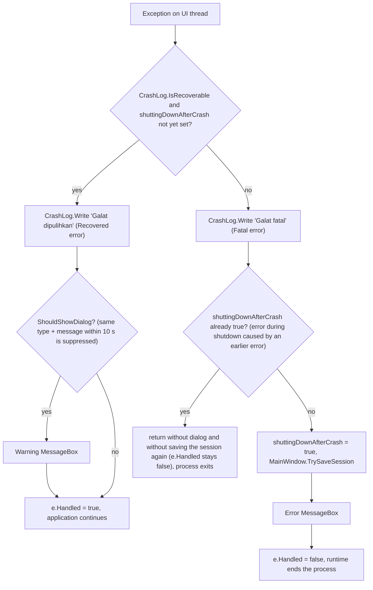

### 4.9 Print Preview (Ctrl+Shift+P) and Print

Code: `MainWindow.PrintPreview_Executed` (`MainWindow.xaml.cs:766-793`) and `Print_Executed` (`:583-601`), `PrintPreviewWindow`
(`PrintPreviewWindow.xaml.cs:45-120, 421-486`), `PrintSource`/`PrintService` (`PrintLayout.cs:92-156`), `PreviewBuild`
(`PreviewBuild.cs:91-202`), `HeaderFooterPaginator.cs`.

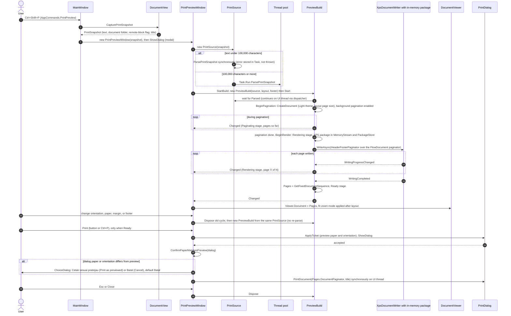

Key points:

- **Snapshot.** `CapturePrintSnapshot` (`DocumentView.xaml.cs:585-586`) copies the text, the document folder, the value of `BlockRemoteImages`,
  and the title when the preview is opened. Edits, closing the tab, or `Simpan Sebagai` (Save As) afterwards do not change the preview or its re-layout
  (`Snapshot_*` tests in `PrintPreviewWindowBehaviorTests.cs`). The preview is modal, so the editor also cannot change while it is open.
- **Parse.** Text under `DocumentView.BackgroundParseChars` (100,000 characters) is parsed synchronously in the `PrintSource` constructor
  (`PrintLayout.cs:103-104`); the rest goes through `Task.Run` (`:99`). The AST is reused by all cycles of the same window, so changing paper
  or margins only creates a new `FlowDocument` (`PrintSource.CreateDocument`), not a re-parse. Remote/UNC/`ftp:`/`data:` images
  are already blocked in the AST by `ResolveImageUrls` (through `ParseDocument`), the same as the main preview.
- **Background pagination** is `IsBackgroundPaginationEnabled` on the FlowDocument paginator (`PreviewBuild.cs:130`). It runs on the UI thread
  in chunks through the dispatcher, not on a separate thread (comment at `PreviewBuild.cs:250`), so the UI stays responsive, but
  `Dispose()` must turn it off. The XPS write (`WriteAsync`) also reports through the dispatcher; its internal WPF behavior is not verified.
- **Why XPS.** `DocumentViewer` displays only fixed documents, not a `FlowDocument` ([ADR-19](DESIGN-DECISIONS.md#adr-19-print-preview-via-in-memory-xps-package)).
  `HeaderFooterPaginator` is written into every XPS page, so changing the footer = a new cycle.
- **Printing from the preview** prints the pages on screen (`build.Pages.DocumentPaginator`, the same XPS package), not a re-pagination
  (`PrintPreviewWindow.xaml.cs:446-447`), synchronously on the UI thread; the "Mencetak..." (Printing...) indicator is drawn first
  through `Dispatcher.Invoke(..., Render)` (`:442-444`). The button/command is enabled only when the stage is `Ready`, `Pages` exists, no printing is in progress, and
  there is no window error (`CanPrint`, `:96`). Errors other than `OutOfMemoryException` (driver/queue) are shown as the `MessageBox`
  "Gagal mencetak." (Printing failed.) (`:449-453`); OOM is deliberately not caught there and falls through to the global handler ([R8](SECURITY.md#3-residual-risk-and-known-limitations)).
- **`ConfirmPaperMatchesPreview`** (`:466-486`): the XPS pages have a fixed size, so paper/orientation changed by the user in the Print dialog
  is not silently overwritten and is not forced without asking ([ADR-22](DESIGN-DECISIONS.md#adr-22-preview-has-its-own-paper-settings-and-confirmation-when-the-print-dialog-differs)).
  `TicketMatches` (`:518-542`) compares by paper name (including `Rotated` variants) or by width/height (tolerance 4 DIP).
- **Ctrl+P from the main preview panel.** `FlowDocumentScrollViewer` has a class binding for `Print` that takes precedence over the window binding;
  `DocumentView` adds its own `CommandBinding` on `Preview` that forwards to the window path (`DocumentView.xaml.cs:71-76`),
  so Ctrl+P always goes through `Print_Executed` (Light theme, margins, footer).
- **Direct print (Ctrl+P, `Print_Executed`)** does not go through `PreviewBuild`: `PrintDialog` -> `PageLayout.FromPrintableArea` (oriented media size
  from the dialog, Normal margins) -> `PrintService.Print`, which creates a new `FlowDocument`, wraps it in
  `HeaderFooterPaginator` (`PageCount` computed synchronously), and calls `dialog.PrintDocument`. All of it is synchronous on the UI thread
  (`MainWindow.xaml.cs:745-763`, `PrintLayout.cs:150-155`); errors other than OOM are shown through `ShowError("Gagal mencetak.")` (Printing failed.).
  Direct print does not offer a page range (not yet in the code).

### 4.10 XPS package lifecycle and preview error handling

Code: `PreviewBuild.Dispose/ScheduleCleanup/Cleanup` (`PreviewBuild.cs:240-329`), `Guard/Fail` (`:211-238`),
`PrintPreviewWindow.StartBuild/ShowFailure/ApplyBuildState` (`PrintPreviewWindow.xaml.cs:103-177`).

The XPS package (`MemoryStream` -> `Package` -> `XpsDocument`, registered in `PackageStore` with the URI `pack://makdon-preview-N.xps`,
`PreviewBuild.cs:160-165`) is used by `DocumentViewer` through that URI. `DocumentViewer` loads `PageContent` asynchronously; closing the package early
makes already-queued loads throw `UriFormatException` on the dispatcher (comment at `PreviewBuild.cs:291-292`). For this reason the package
is closed only after the dispatcher is idle and only after the XPS writer has actually stopped:

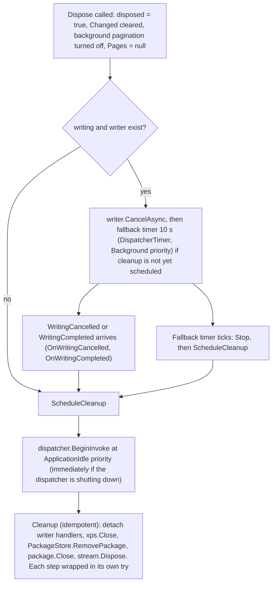

`ScheduleCleanup` stops and removes the fallback timer (`:297-298`), so the timer does not linger and keep the `PreviewBuild`
(document, AST, text) in memory; the tests `Dispose_WhileRendering_ArmsAFallbackTimer_*` and
`Dispose_WhenCleanupIsAlreadyScheduledDuringCancel_*` guard this.

Errors: the preview does not change the document, so its errors are always treated as recoverable and must not escape to the dispatcher (the
fatal error path of the application, 4.8).

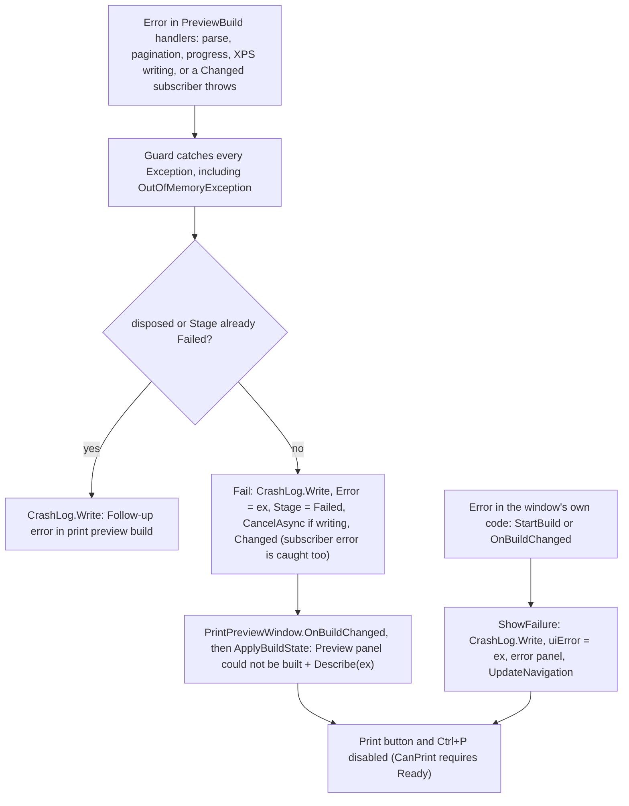

`Describe` replaces `OutOfMemoryException` with "Memori tidak cukup untuk menyusun pratinjau dokumen ini." (Not enough memory to build the
preview of this document.) and uses `ex.Message` for everything else (`PrintPreviewWindow.xaml.cs:137-138`). A failure of FlowDocument rendering on the print path arrives as an
`InvalidOperationException` with a friendly message and no path ([ADR-24](DESIGN-DECISIONS.md#adr-24-error-documents-are-never-printed)).
Window creation in `PrintPreview_Executed` is caught separately (OOM: memory message; others: "Gagal membuka pratinjau cetak." (Failed to open print preview.)),
while `ShowDialog` is deliberately outside the `try` (`MainWindow.xaml.cs:770-792`).

## 5. Thread model

| Work | Thread | Evidence |
| --- | --- | --- |
| All UI, `DocumentTab`, `DocumentView`, `FindReplaceBar`, `MainWindow` | UI thread (WPF Dispatcher) | `DocumentTab` captures `Dispatcher.CurrentDispatcher` when created (`DocumentTab.cs:26`) |
| Timers: `renderTimer`, `statsTimer` (`DocumentView`), `changeTimer` (`DocumentTab`), `queryTimer`, `refreshTimer` (`FindReplaceBar`) | UI thread (`DispatcherTimer`) | `DocumentView.xaml.cs:32-33`, `DocumentTab.cs:27,69`, `FindReplaceBar.xaml.cs:22-23` |
| Read/hash/write of document files, export, `CheckExternalChange` | UI thread, synchronous | no `Task.Run` in `DocumentTab`/`HtmlExporter`/`MainWindow` |
| Direct print (Ctrl+P): build document, `ComputePageCount`, `PrintDialog.PrintDocument` | UI thread, synchronous (freezes the UI while running) | `MainWindow.xaml.cs:745-763`, `PrintLayout.cs:131-155` |
| Markdig parse + `ResolveImageUrls` for the main preview, documents of 100,000 characters or more | Thread pool; result continues on UI thread (`await` without `ConfigureAwait(false)`) | `DocumentView.xaml.cs:27, 401` |
| Parse of the Print Preview snapshot (`PrintSource`), 100,000 characters or more | Thread pool (`Task.Run`); `PreviewBuild` waits for it with `ConfigureAwait(false)` and returns to the UI thread via `dispatcher.BeginInvoke`, not depending on `SynchronizationContext`. Below the threshold: synchronous on the UI thread. A running parse is not canceled when the window closes (Markdig has no cancellation points); its result is discarded with the `PrintSource` | `PrintLayout.cs:92-105`, `PreviewBuild.cs:102-124` |
| Building the `FlowDocument` (`CreateFlowDocument`, `PrintSource.CreateDocument`) | UI thread (required) | comment `DocumentView.xaml.cs:395`; `PrintLayout.cs:118` |
| Background FlowDocument pagination and async XPS writing (`PreviewBuild`) | UI thread, in chunks through the dispatcher; not a separate thread. Progress/completion notifications (`Changed`) are raised from dispatcher callbacks, and `Dispose()` must stop its pagination. WPF's internal details for the XPS writer are not verified | comment `PreviewBuild.cs:250`; `PreviewBuildTests.cs:168-196` (pagination stops after `Dispose`) |
| XPS package cleanup | UI thread, `DispatcherPriority.ApplicationIdle`; fallback timer 10 s (`DispatcherTimer`, `Background` priority) | `PreviewBuild.cs:32, 268, 293-301` |
| `FileSystemWatcher` events | Thread pool, moved to UI via `dispatcher.BeginInvoke` | `DocumentTab.cs:383-391` |
| `SingleInstance` pipe loop | Thread pool (`Task.Run`, `ConfigureAwait(false)`); the `onFiles` callback runs on a background thread, then `Dispatcher.BeginInvoke` | `SingleInstance.cs:90-151`, `App.xaml.cs:59-60` |
| `SystemEvents.UserPreferenceChanged` (`Ikuti Sistem` (Follow System) theme) | Moved to UI via `BeginInvoke` | `Theming.cs:103-110` |
| `CrashLog.Write` | Any thread; serialized with `lock (Gate)` | `CrashLog.cs:17, 33` |

Consequence: large I/O operations (loading files of hundreds of MB, export with many images, hashing during a "racy" stamp) freeze the UI
while they run; the size limits and export budget exist to bound this. Printing (direct print and the Print button in the preview) is also
synchronous; building the Print Preview is not (async, "Menyusun halaman..." (Laying out pages...) indicator). Building the `FlowDocument` for a very large document
stays on the UI thread and can freeze the UI: this has been measured for the main preview (README, Known limitations), but not yet for
Print Preview. Regex search is also synchronous on the UI thread, limited to 2 s per
match and 4 s in total (`SearchEngine.cs:24-25`). Thread safety of the static `MarkdownSupport.Pipeline` (used by background threads and
the UI) is not verified.

## 6. State model

### 6.1 `DocumentTab`

| State | Meaning | Changed by |
| --- | --- | --- |
| `IsDirty` | Derived as `!Document.UndoStack.IsOriginalFile`. Not a flag of its own: undoing back to the original version makes the tab clean again. | Edit, Undo, `MarkAsOriginalFile` in `SaveCore` and `ApplyDiskContent` |
| Undo | Reload (automatic or user choice) = `StartUndoGroup` + `Replace` + `EndUndoGroup` + `MarkAsOriginalFile`: the tab is clean, but Undo still restores the old editor text (and the tab becomes dirty) | `ApplyDiskContent` (`DocumentTab.cs:325-345`) |
| `diskHash`, `diskStamp` | Contents/stamp of the file last known to match the disk | Only in `Load`, `SaveCore`, `ApplyDiskContent`, `KeepEditorVersion`, and stamp refresh in `CheckExternalChange`/`IsChangedOnDisk` when the hash has not changed. `null` for an untitled tab: no external check and no save conflict |
| `pendingHash`, `pendingStamp` | External change already reported (`ExternalChangeConflict`) but not yet answered; `HasExternalConflict = pendingHash is not null`. `diskHash` is deliberately not changed until there is an answer, so the next save still detects the conflict | Set by `CheckExternalChange`; cleared by `SaveCore`, `ApplyDiskContent`, `KeepEditorVersion`, or when the hash becomes equal again |
| `saving` | `true` during `SaveTo` (including the save-conflict dialog, which pumps messages): `CheckExternalChange` is postponed so that no second conflict dialog appears | `SaveTo` (`try/finally`) |
| `IsLossyDecoded` | A BOM file contained invalid bytes replaced with U+FFFD; saving asks for confirmation | Set by `Load` and `ApplyDiskContent`; cleared by `SaveCore` |
| `Encoding` | Encoding used when saving; may be upgraded to UTF-8 on save | `Load`, `SaveCore`, `ApplyDiskContent` |
| `disposed`, `changeRetries` | Lifecycle guards; limit of read attempts for locked files (5, including the initial read) | `Dispose`; `OnDiskEvent` resets the count |

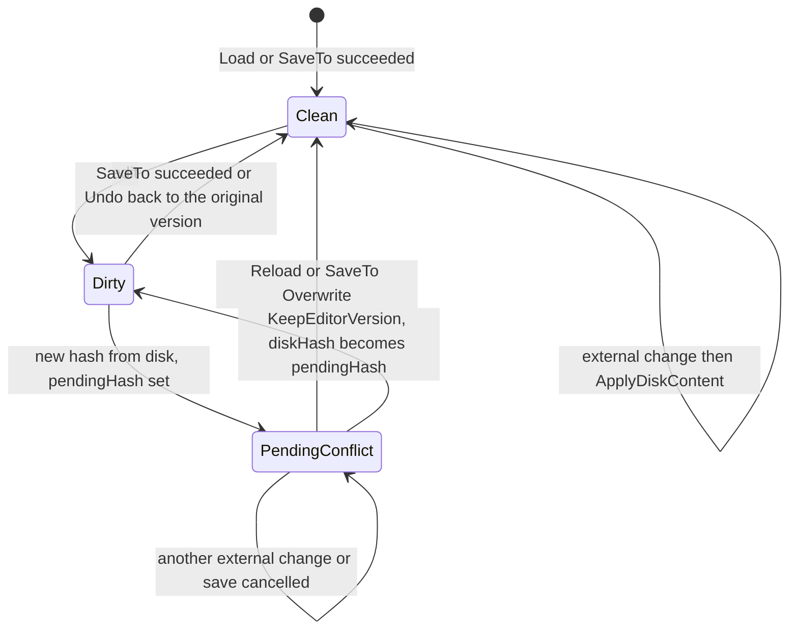

### 6.2 `MainWindow`

| State | Meaning |
| --- | --- |
| `conflictQueue` + `conflictPromptOpen` | One conflict dialog at a time. The dialog is modal but pumps messages, so conflicts of other tabs arrive while it is open; they are only queued and processed after the dialog closes (`MainWindow.xaml.cs:318-344`). `OnSaveConflict` uses the same flag and restores its old value (`:371-392`). |
| `preserveStoredSession` | `true` when the instance was opened with file arguments: on exit `Session` in `settings.json` is not overwritten. It becomes `false` as soon as `OpenUserFile` actually returns a tab (hand-off from another instance, Open dialog, drag-and-drop, `Berkas Terakhir` (Recent Files)). Session restore and startup arguments use `OpenFile` directly, so they do not "adopt" the session. `forceSession` (fatal error) ignores it. |
| `closing`, `closed` | `closing`: closing is in progress; reset if the user cancels. It has only two effects: `ProcessConflictQueue` in the `finally` of `TrySave` is skipped (`MainWindow.xaml.cs:448`), and file hand-offs from other instances are ignored (`:65`, together with `closed`). `closed`: after `Window_Closed`. |
| `zoomPercent`, theme | Copied to `AppSettings` in `SaveSettings`. |

### 6.3 `DocumentView`

`previewStale`, `lastRenderedText` (not kept when 1 million characters or more), `lastRenderedVersion`, `renderGeneration`,
`renderInFlight`, `pendingAnchor` (anchor waiting for the render to finish), `expectedEditorOffset`/`expectedPreviewOffset`/
`scrollSyncSuspended` (prevent feedback loops in scroll sync), `disposed`. The static flag `BlockRemoteImages` applies to all tabs
and is changed from `MainWindow` (`LoadRemoteImages_Click`), followed by `RefreshPreview` on each tab.

### 6.4 `AppSettings`

`removedRecent` (files this instance deliberately removed from the recent list, so that they do not "come back" when merged with the
file contents) is per instance and is not saved. Saved data: `Theme` and `SessionTab.Mode` as text, so that an unknown value does not break
the whole file (`Sanitize` + `ParsedMode` falls back to the default).

### 6.5 `PreviewBuild` and `PrintPreviewWindow`

`PreviewBuild.Stage` (`PreviewStage`) only moves forward; a cycle that is already `Ready`/`Failed` is not reused (changing the layout
creates a new cycle, `PrintPreviewWindow.StartBuild`).

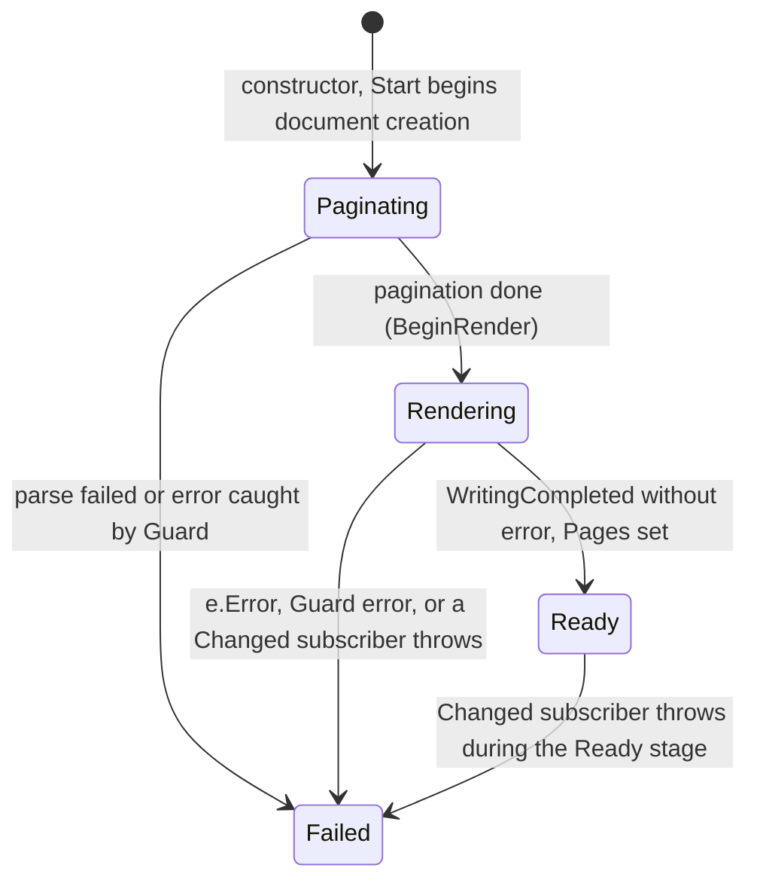

`Dispose()` does not change `Stage`: afterwards there are no more `Changed` events, `Pages` becomes `null`, and `Start()` does nothing
(`PreviewBuildTests.Dispose_*`, `Dispose_BeforeStart_ThenStart_DoesNothing`). A cycle discarded during `Paginating`/`Rendering` keeps that status.

| State | Meaning | Changed by |
| --- | --- | --- |
| `Stage`, `PageCount`, `RenderedPages` | Stage; during `Paginating` the page count so far, afterwards the final count; XPS pages already written | `BeginPagination`, `OnPaginationProgress`, `BeginRender`, `OnWritingProgress`, `OnWritingCompleted`, `Fail` |
| `Pages`, `Error` | `FixedDocumentSequence` (only `Ready`); cause error for `Failed` | `OnWritingCompleted`, `Fail`; `Dispose` clears `Pages` |
| `started`, `disposed`, `writing` | `Start` only once; after `disposed` all handlers exit without work; `writing` is true while `WriteAsync` has not reported completion/cancellation | `Start`, `Dispose`, `BeginRender`, `OnWritingCompleted/Cancelled` |
| `cleanupScheduled`, `cleanedUp`, `cleanupFallback` | Package cleanup is scheduled once and run once; the 10 s fallback timer exists only while the writer was canceled but has not reported | `Dispose`, `ScheduleCleanup`, `Cleanup` |

The window (`PrintPreviewWindow`): `paper`/`orientation`/`margin` (choices in a segmented control; defaults A4, portrait, Normal; not saved to
`settings.json` and not carried over to the next opening), `zoomMode` (`FitPage`, `FitWidth`, `Actual`, `Custom`), `printing` (during
`PrintDocument`), `uiError` (error in the window's code, disables Print), `goToTarget`/`goToOffset`/`goToZoom` (target of Next/Previous navigation/
the page box; valid until scrolling or zoom changes; `CurrentPage`, `PrintPreviewWindow.xaml.cs:232-241`), `lastCanPrint` (so that
`CommandManager.InvalidateRequerySuggested` is not called on every progress notification).
